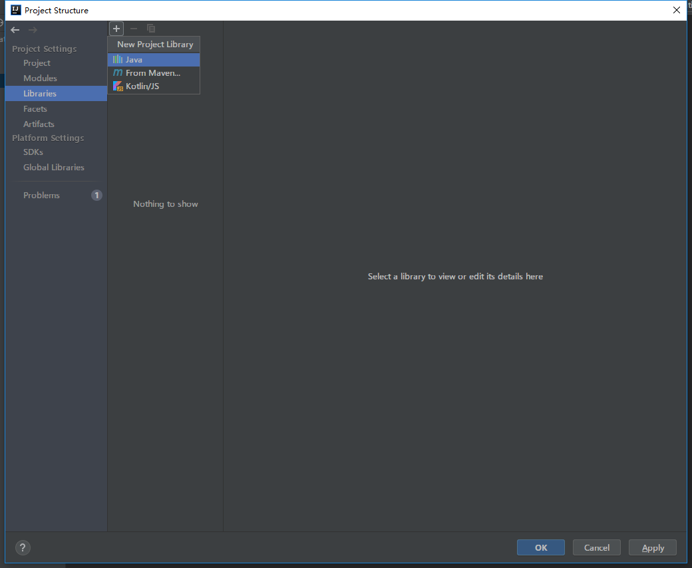
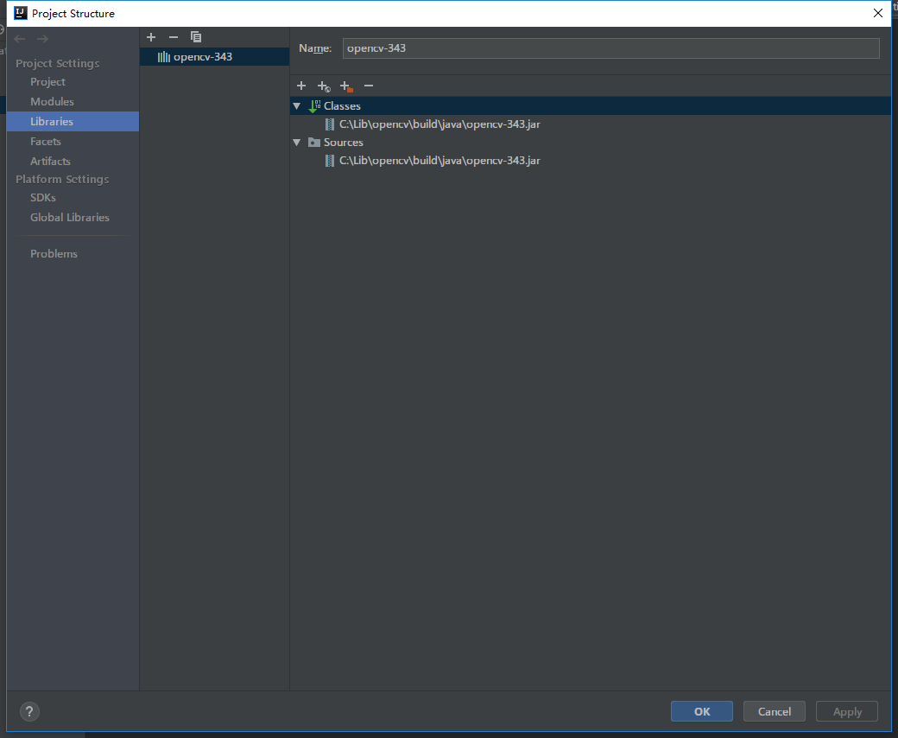
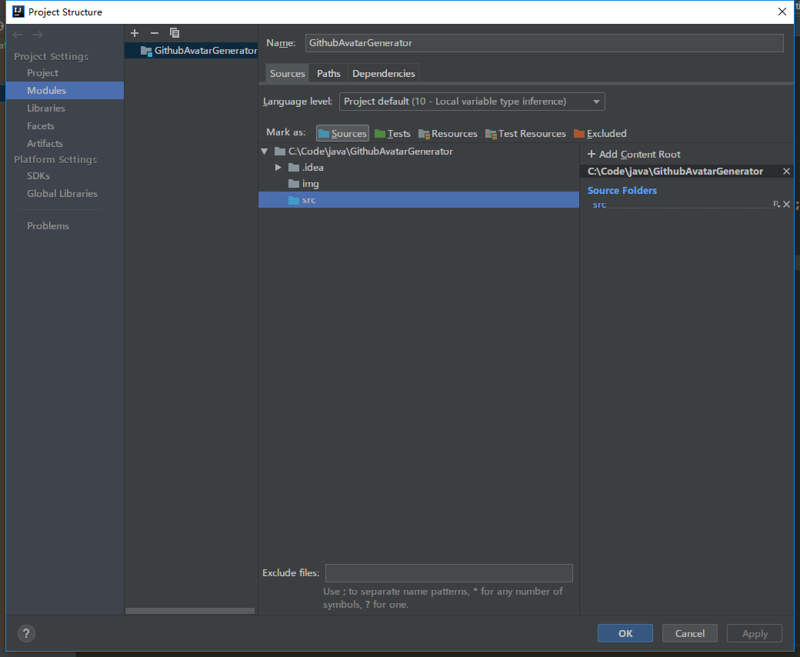
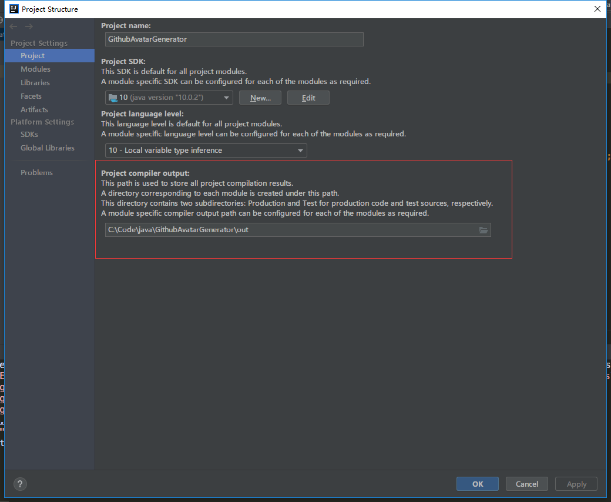
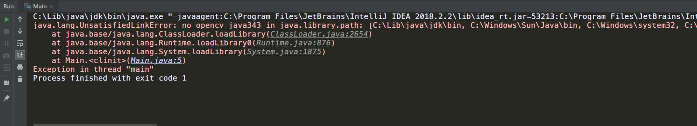
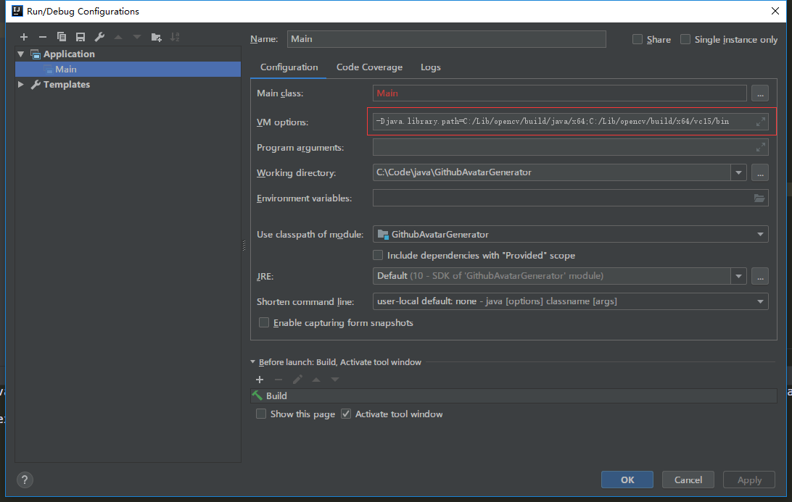

# GitHub默认萌萌哒头像生成器
使用`Java`+`OpenCV3`制作，用于生成萌萌哒的`GitHub`默认头像，就像这种:

这个程序的功能就是随机批量生成一些这样的萌萌哒头像，不得不说`GitHub`的设计思路真的不错

# 环境配置
在运行前，需要先配置`OpenCV3`的环境，官网的下载地址在这: [OpenCV - Releases](https://opencv.org/releases.html)，这个地址中有各个版本的`OpenCV`提供下载，选择适合自己的包下载

下载完成之后解压或者安装到某一个目录，比如我解压到的位置为: `C:\Lib\opencv`，可以看到目录结构如下:

接下来需要将`OpenCV`添加到项目依赖中来，这里以`IDEA`为例，先在`IDEA`中导入这个项目，导入完成之后点击`Project Structure`按钮，进入`Libraries`面板，如下:

添加`Java`依赖，选择到刚刚安装`OpenCV3`的目录下的`/build/java/opencv-xxx.jar`，并添加，可以看到现在依赖如下:

另外，为了让`IDEA`能够找到我们的源文件，需要将项目下的`/src`文件设为源文件夹，进入`Modules`面板然后将`/src`设置为源文件夹:

同样的，编译、输出目录也需要调整，在`Project`面板中把`compiler ouput`一栏的目录改成`你的项目所在的目录 + \out`:

到了这一步点击编译运行其实是还不能运行的，因为程序无法找到`OpenCV3`的动态链接库:

这时候编辑运行配置，在`VM-Options`一栏上加上两个`path`即可，一个是`OpenCV3 Java`的动态链接库目录，一个是`OpenCV3`二进制文件目录，按照你的实际情况填写就行了

到这里环境配置就算结束了

# 运行
编译运行即可，看看是不是多了20张萌萌哒的`GitHub`默认头像了?生成的配置你完全可以在代码里面改，我懒得做配置文件了233，溜了溜了~
